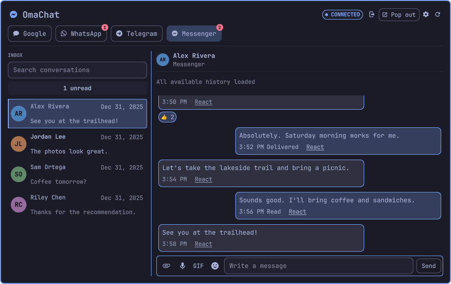
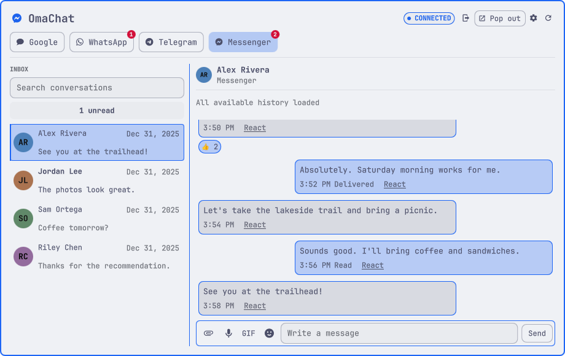
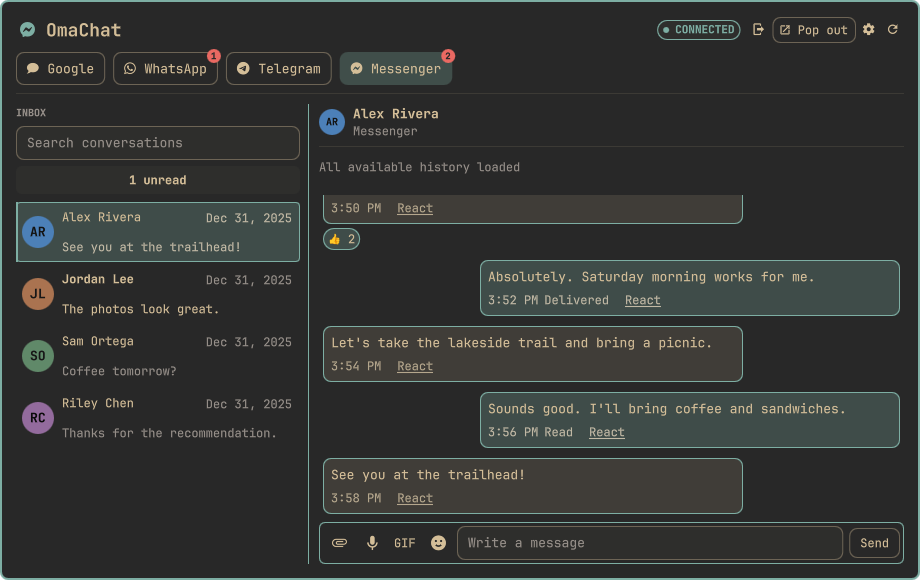

# OmaChat

A **Native Omarchy Plugin** for Google Messages, WhatsApp, Telegram, and Messenger.
Read and reply to conversations in a native panel with separate service
sessions, conversation drafts, history, and inline media.

Current stable release: **0.4.3**. [Release notes](https://github.com/onelegdave/omachat/releases/tag/v0.4.3).



The preview shows the current QML panel with fictional contacts and messages,
all four service tabs, unread badges, and reactions using the Tokyo Night base
palette. Connection and delivery states are simulated.
Never include private conversations or account details in public screenshots.

<details>
<summary>More theme examples: Catppuccin Latte and Gruvbox</summary>





These demo captures use stock theme base colors with default control styling.
See the [gallery and reproduction details](docs/screenshots/README.md).

</details>

## Install and build

On an Omarchy desktop with the Quickshell plugin system:

```bash
omarchy plugin add https://github.com/onelegdave/omachat --enable
```

Open OmaChat from the bar. All services use one helper, `omachatd`, built
locally from vendored source. Building requires **Go, Python 3, and a C compiler
(gcc or clang)**, even if you only use Google Messages or Telegram.
No helper binary is shipped in Git or downloaded by OmaChat.

OmaChat remains an anchored bar panel by default. Select **Pop out**
in the panel header when you want a standalone pop-out. The pop-out includes
its own **Tiled** and **Floating** choices, which affect only that OmaChat
window and do not change your desktop-wide window settings. Select
**Return to panel** to move the same conversation view, including its current
drafts and selection, back to the bar.

**OmaChat never installs dependencies automatically.** Settings includes a
dependency checklist with source-review links and optional Install buttons.
Installation opens a terminal for your confirmation and keeps the package
manager's own confirmation prompt. You decide which tools and features you want.
You can also install tools manually. For example:

```bash
omarchy pkg add go gcc python
```

Then select **Build helper** in the panel. This compiles the included source
with `go build -mod=vendor`; it does not install packages or download modules.
The first build can take several minutes depending on your hardware. Go may
show no output while compiling. Wait without restarting the Omarchy shell;
the helper starts automatically on success, or the panel displays a build error.
The shell owns the helper as a child process. There is no systemd unit,
installer hook, or automatic privileged step. Only the explicit dependency
Install action can request sudo in a terminal, after your confirmation.

See [dependencies and optional features](docs/dependencies.md) for the full
tool list. Availability varies by desktop; do not assume a tool is installed.

## Updates

Open **Settings > Updates** to see your installed version, check for a newer
release, and read its release notes. Daily checks are optional and off by
default. Checks contact GitHub for public release metadata; they do not send
messages or account credentials. GitHub can see the request's IP address.
You can dismiss a release notice until another release is available.

Select **Update** to open Omarchy's updater in a terminal. Review its changes
and confirm there. You can also run it yourself:

```bash
omarchy plugin update onelegdave.omachat
```

After the plugin reloads, follow any **Rebuild helper** notice in Settings.
Wait for the build and helper restart to finish before treating the update as
complete. A failed build keeps the previous executable; review the error and
retry after addressing it. Updating does not deliberately remove your paired
accounts. Read release notes for any migration or re-pairing requirements.

Omarchy's updater follows the repository's default branch, not a specific
release tag. A canceled or failed update has not installed the release.
If the panel does not reload, run `omarchy restart shell`, then check Settings
again. If a helper outside this plugin is still running, the app may ask you
to restart the shell rather than claiming the new helper is active. If that
does not resolve it, stop the separately launched `omachatd` first.

For notifications outside OmaChat, open the
[GitHub repository](https://github.com/onelegdave/omachat), select **Watch >
Custom > Releases**, and follow the
[release notes](https://github.com/onelegdave/omachat/releases).

## Connect your services

Each service is optional and pairs only when you request it.

| Service | Setup | Guide |
| --- | --- | --- |
| Google Messages | Sign in to Messages for web in a supported Chromium-family browser, then select **Pair with Google** and confirm the matching emoji on the phone. | [Google Messages](docs/services/google-messages.md) |
| WhatsApp | Select **Use a QR code** in the WhatsApp tab and scan it using the phone's **Linked devices** screen. | [WhatsApp](docs/services/whatsapp.md) |
| Telegram | Configure your own Telegram API credentials, select **Pair with Telegram**, and scan the QR code from Telegram's **Devices** screen. | [Telegram](docs/services/telegram.md) |
| Messenger | Sign in to Facebook or Messenger in a supported Chromium-family browser, then select **Pair from browser**. | [Messenger](docs/services/messenger.md) |

The guides include requirements, pairing, supported features, limitations,
storage, and recovery. A service losing authentication does not automatically
start pairing again.

## Features and limits

| Feature | Google Messages | WhatsApp | Telegram | Messenger |
| --- | --- | --- | --- | --- |
| Conversation list, text, per-chat drafts | Yes | Yes | Yes | Yes |
| Photos and captions | Yes | Yes | Yes | Yes |
| Send GIF files | Yes | Yes (ffmpeg) | No dedicated GIF sending support | Yes |
| Voice recording and playback | Optional ffmpeg/ffplay | Optional ffmpeg/ffplay | Optional ffmpeg/ffplay | Optional ffmpeg/ffplay |
| GIPHY search | Optional personal API key | Optional personal API key + ffmpeg | Unavailable | Optional personal API key |
| Reactions | Yes | Yes | Yes (chat-dependent) | Yes |
| Incoming static WebP stickers | No dedicated sticker support | Yes | Yes | Yes |
| Older history | Fetch older pages | Page cached phone-sync history | Fetch older pages | Fetch older pages |
| Calling | Unavailable | Unavailable | Unavailable | Unavailable |

Threads open with the latest 60 messages; **Load older messages** pages back
while preserving the reading position. WhatsApp cannot currently request
additional phone history beyond what has synced. Telegram animated TGS/video
stickers are unsupported, and media references need refreshing after restart.
WhatsApp view-once/ephemeral and Telegram self-destructing media are not saved
or reopened.

The services use unofficial protocol clients and can stop working when their
providers change. Automated checks do not establish live account compatibility
for every service. See [verification history](docs/history/README.md) for dated
evidence and its limits.

## Everyday use

Choose enabled services in **Settings > Services**. Apply briefly restarts the
shared helper, so enabled services reconnect. Disabled services stop background
activity and disappear from the tabs without deleting credentials. You may turn
off every service. Fresh installations ask you to choose before connecting;
upgrades preserve existing choices. See [service opt-outs](docs/service-selection-plan.md).

Settings includes text-size choices, service setup guides, optional-tool
instructions, and upstream credits. Setup messages wrap and scroll, including
at larger text sizes. Popup and message text adapt to the current theme's
background for readable contrast.

Switch services with the header tabs, choose a conversation, and press Enter
to send. Drafts stay with their service and conversation. Right-click a bubble
to copy it. Middle-click the bar icon to refresh; its badge counts unread
conversations across active services, and each service tab shows its own unread
badge while the app is open.

Pick an attachment from the composer. Google Messages sends captions separately
after the attachment; check the conversation before retrying a caption reported
as unconfirmed. WhatsApp, Telegram, and Messenger include captions with images;
Messenger sends a document caption as a separate message. Failed media downloads
can be retried. Incoming GIFs play inline;
video opens in an external player.

For voice notes, choose **Rec**, record, **Play**
to preview, then send. Voice needs optional `ffmpeg` and `ffplay`. Google
Messages, WhatsApp, and Messenger record M4A; Telegram records OGG/Opus.
WhatsApp uses a standard audio clip instead of native PTT because linked-device
OGG/Opus notes fail to play on iPhone. Google, WhatsApp, and Messenger GIF
search require your own GIPHY API key in Settings; sending a local GIF does not
require a key. WhatsApp uses ffmpeg to convert GIF files to the MP4 playback
format required by its protocol.

Message reactions are available on Google Messages, WhatsApp, Telegram, and
Messenger. Telegram supports the standard emoji choices shown by OmaChat;
individual chats or channels may restrict which reactions Telegram accepts.

Use Tab to move between controls, arrow keys and Enter to open a conversation,
and Space or Enter to activate focused buttons. Pending and failed text sends
remain visible when you return to their conversation during the current shell session.

## Privacy, storage, and removal

Sessions, chat caches, media, and drafts are separated by service. All four
services share the helper process and configuration file. Private files are
kept locally; see [Security](SECURITY.md) for protections and limitations.
Each service limits its downloaded attachment cache to 256 MiB and evicts older
files as new downloads complete.

| Location | Contents |
| --- | --- |
| `~/.config/omarchy/plugins/onelegdave.omachat/` | Plugin checkout and locally built helper |
| `~/.local/share/omachat/session.json` | Google Messages credentials |
| `~/.local/share/omachat/whatsapp.db` and `whatsapp_store.json` | WhatsApp credentials and chat cache |
| `~/.local/share/omachat/telegram.session` and `telegram_store.json` | Telegram credentials and chat cache |
| `~/.local/share/omachat/messenger_session.json` and `messenger.db` | Messenger session cookies and encrypted-device state |
| `~/.local/share/omachat/config.json` | Service choices, text size, browser selection, GIPHY key, Telegram API credentials |
| `~/.cache/omachat/media/`, `media_whatsapp/`, `media_telegram/`, `media_messenger/` | Service-specific media caches |
| `$XDG_RUNTIME_DIR/omachat/daemon.sock` | Private plugin/helper control socket |

Before uninstalling, select **Unpair this desktop** on each connected service
tab. This clears that service's local session and cached content. Follow any
cleanup or remote-revocation warning, and check the phone's linked-device list
for each service. Then run:

```bash
omarchy plugin remove onelegdave.omachat
```

Uninstalling does not erase account data. If you want to remove all remaining
OmaChat data, including API keys, delete `~/.local/share/omachat/` and
`~/.cache/omachat/` yourself after unpairing. This affects all four services.

## Development and documentation

The QML UI uses Omarchy's `qs.Ui` and `qs.Commons` components. Protocol work
runs in the shell-owned Go helper; media capture runs in external processes.

```bash
make helper
make test
make lint
make validate
make test-ui
```

See [Contributing](CONTRIBUTING.md) for prerequisites and verification,
[Security](SECURITY.md) for reporting, and the [documentation index](docs/README.md)
for service guides, release notes, and historical reviews.

Marketplace submission is pending the [oldsmaru acceptance check](docs/oldsmaru-checklist.md).
See [marketplace readiness](docs/marketplace-readiness.md) for check results,
review capabilities, and their limits. OmaChat is not claiming marketplace approval.

## Support my work

I build OmaChat as a free, open-source project. If you find it useful, you can [buy me a coffee](https://buymeacoffee.com/onelegdave). Contributions are entirely optional and never required to use any feature.

## Credits and license

Created and maintained by [OneLegDave](https://www.onelegdave.dev/)
([GitHub](https://github.com/onelegdave) · [X](https://x.com/OneLegDavePDX)), with AI assistance from Codex.

The helper is adapted from [Marc Ford's gmessages-omarchy-plugin](https://github.com/MarcFord/gmessages-omarchy-plugin).
Google Messages uses [mautrix libgm](https://github.com/mautrix/gmessages),
WhatsApp uses [whatsmeow](https://github.com/tulir/whatsmeow), Telegram uses
[gotd/td](https://github.com/gotd/td), and Messenger uses
[mautrix-meta](https://github.com/mautrix/meta).

OmaChat v0.4.3 and later is licensed under AGPL-3.0-or-later. Earlier OmaChat
releases retain their original MIT grant. Vendored dependencies retain their
own terms, including the AGPL terms for libgm and mautrix-meta and the MPL-2.0
license for whatsmeow. See
[Credits and third-party notices](CREDITS.md), [LICENSE](LICENSE), and [NOTICE](NOTICE).

Other plugins: [OmaDroid](https://github.com/onelegdave/omadroid) and
[System QuikView](https://github.com/onelegdave/system-quikview).
