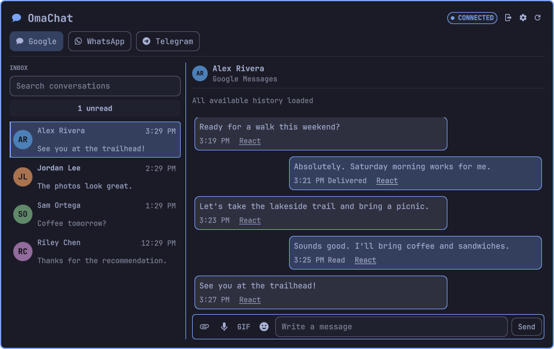

# Theme gallery

These are captures of the real OmaChat QML panel with fictional contacts and
messages, rendered using the stock Omarchy theme base palettes listed below.
The fixture uses default control styling, not machine-specific shell overrides.
The connected state and delivery receipts are simulated demonstration data.
They are not proof of live connectivity or a full desktop theme installation.

## Tokyo Night

## Catppuccin Latte

## Gruvbox

Generated with `python3 tests/render-gallery.py` on an Omarchy Wayland desktop.
The renderer never starts the protocol helper or accesses accounts. It reads
the installed stock `colors.toml` files and changes colors only inside its
temporary process. No real contacts, messages, profile images, or wallpaper
assets are used. The root preview is the Tokyo Night capture.
